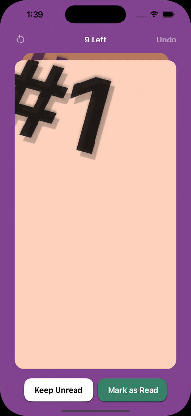
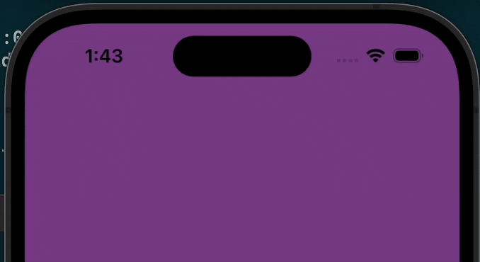
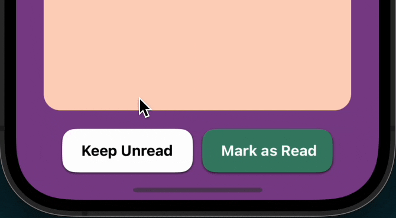
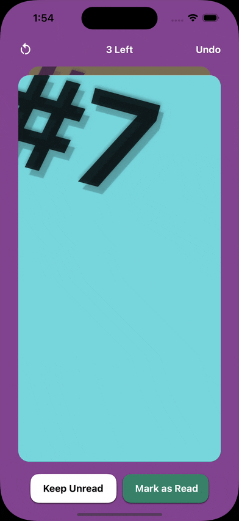

# react-native-slack-catch-up

<p>

[](https://github.com/expo/expo)
[](https://github.com/expo/expo)
[](https://github.com/expo/expo)
</p>

Slack's upcoming "Catch Up" tinder-like mobile app feature shared [here](https://x.com/metasidd/status/1745244070757216547?s=20), built in `react-native` & `typescript` with smooth ✨ **60fps** ✨ native reanimated & gesture-handler animations.

## 📱 Demo

https://github.com/gupta-ji6/react-native-slack-catch-up/assets/21218732/10592701-75c6-45e7-90a7-41424d1bd7b5

## Features

- [x] 👆 Swipe right to mark as read, or left to keep unread.
- [x] ✔ Show different overlays on basis of swipe direction with animated opactiy depending on translation.
- [x] 🫰 Snap back card if swipe velocity is less than the configurable threshold.
- [x] ↔ Action buttons for swipe left & swipe right functionalities for accessibility & quick action.
- [x] ↩️ Undo anytime, we all make mistakes.
- [x] 🔢 Show number of threads left to catch up.
- [x] 👀 Show a peek of next card, if existing.
- [x] 🙌 The OG emoji & title of Slack at stack end.
- [x] 🔁 Reset whole stack to start again.
- [x] ✨ 60fps native animtions running on UI thread.
- [x] 💪 TypeScript support.
- [x] ⚛️ Reusbale React functional components with configurable props.
- [x] ♻ Supports Android, iOS & Web platforms.

## ✨ Micro Interactions & Animations

### 1. ⬆ Stack Enter Animation

The card stack smoothly slides in down on render. The action buttons below & header animates in same manner to compilment the motion.


### 2. 👆 Top Card Touch Up & Touch Down Interaction

The top most card smoothly scales up & down on touch to make the user feel it's interactive.



### 3. 👀 Next Card Peek

It's a design principle to always show a part of next item in a list, to give a hint to user that there's more to explore.



### 4. 🫰 Snap Back To Center On Low Swipe Velocity

The card smoothly snaps back to it's position if the swipe velocity is less than a certain configurable threshold.


### 5. 👉👈 Animated Swipe Overlays

When user swipes in either direction, an overlay of the action is shown with animated opacity. the next card also scales up simultaneously as swipes away top card.


### 6. 🧃 Juicy Buttons

Buttons you wanna keep smashing because it feels like they're asking for it.



### 7. 🔍 Zoom-In Entrance Of Stack End

When the stack ends, the end view enters with a smooth zoom-in animation & an action button slides in from the bottom.



## Components & API Reference

### `<ThreadStack />`

#### Usage

```tsx
    <ThreadStack
        data={threads}
        onSwipeLeft={(item) => {
            console.warn('left, ', item);
        }}
        onSwipeRight={(item) => {
            console.warn('right', item);
        }}
        allowSwipe
        showActionButtons
        stackEnd={{
            emoji: '🙌',
            heading: 'All Caught Up.',
            showReset: true,
        }}
        header={{
            visible: true,
            showNumberOfThreadsLeft: true,
            showUndoButton: true,
            showResetIconButton: true,
        }}
    />
```

#### Properties

| Name                | Description                                      | Default                                                                                                                          | Required |
| ------------------- | ------------------------------------------------ | -------------------------------------------------------------------------------------------------------------------------------- | -------- |
| `data`              | The array of data to be rendered in the stack    | []                                                                                                                               | Required |
| `onSwipeLeft`       | Callback on swipe left action                    |                                                                                                                                  | Optional |
| `onSwipeRight`      | Callback on swipe right action                   |                                                                                                                                  | Optional |
| `allowSwipe`        | Whether to allow swipe gestures or not           | true                                                                                                                             | Optional |
| `showActionButtons` | Whether to show the action buttons at the bottom | true                                                                                                                             | Optional |
| `header`            | Configuration of header component                | ```{    visible :  true ,    showNumberOfThreadsLeft :  true ,    showUndoButton :  true ,    showResetIconButton :  true , }``` | Optional |
| `stackEnd`          | Configuration for the stack end view             | ```{    emoji :   ' 🙌 ' ,    heading :   ' All Caught Up. ' ,    showReset :  true , }```                                        |


## 🛠️ Built With

> [!NOTE]  
> The initial template was created with `npx create-react-native-app my-app -t with-reanimated`

1. `react-native` - v72
2. `react-native-reanimated` - v3
3. `react-native-gesture-handler` - v2
4. `expo` - v49

## 👨🏻‍💻 Developement

- Run `yarn` or `npm install`
- Run `yarn start` or `npm run start` to try it out.

## 📝 References

- [`react-native-reanimated` docs](https://docs.swmansion.com/react-native-reanimated/)
- [`react-native-gesture-handler` docs](https://docs.swmansion.com/react-native-gesture-handler/)
- [`react-native` docs](https://reactnative.dev/)
- [Slack Brand Color Pallete](https://brand.slackhq.com/color)
- [Expo Vector Icons Directory](https://icons.expo.fyi/Index)
